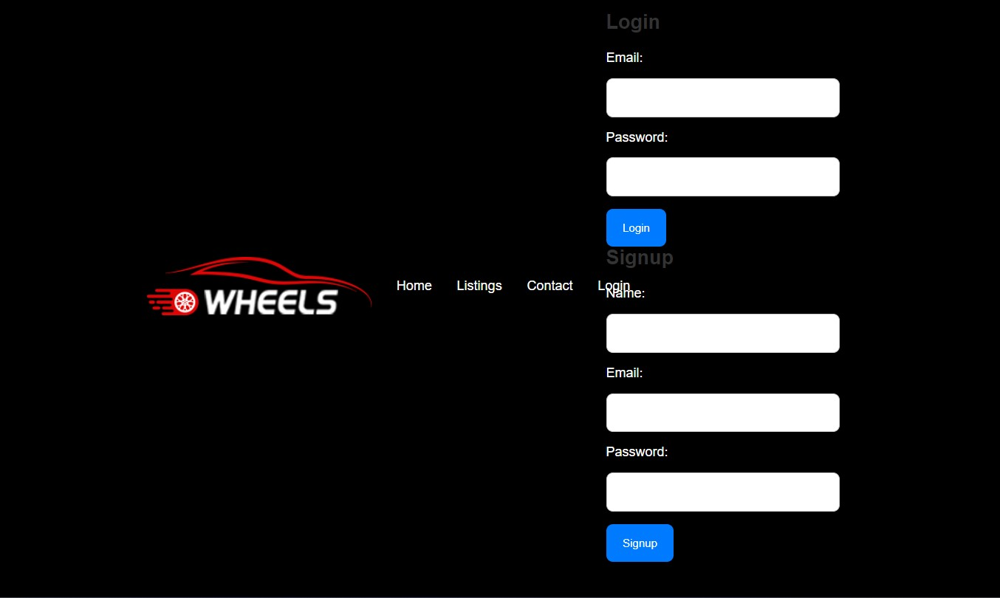
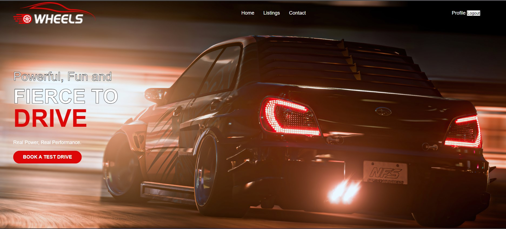
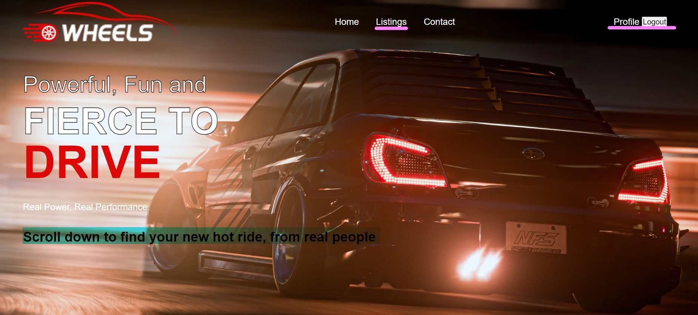
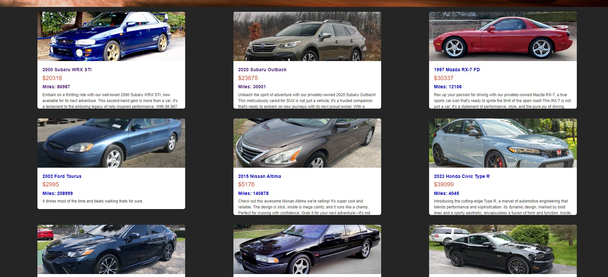
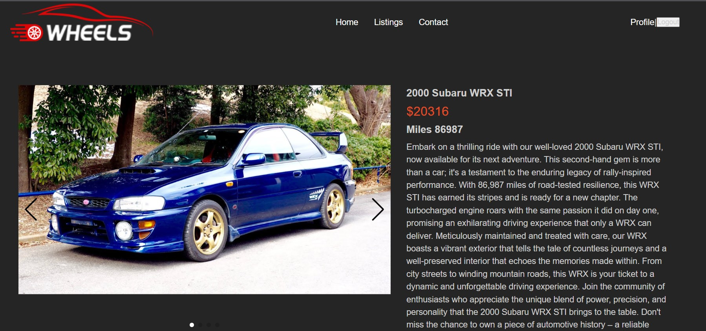
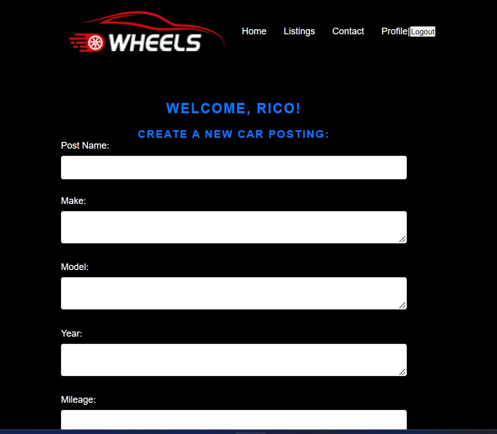
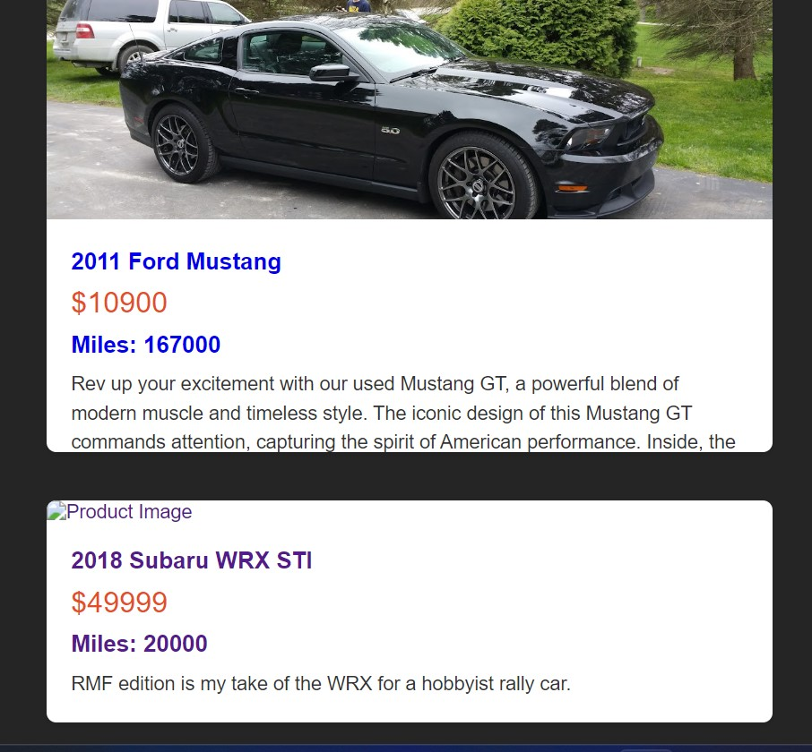
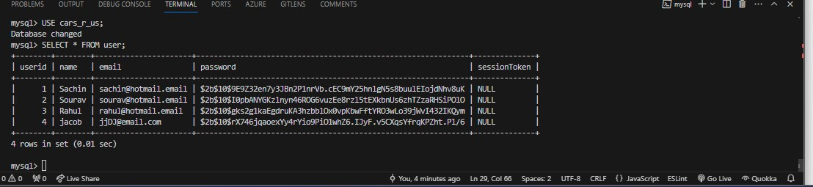
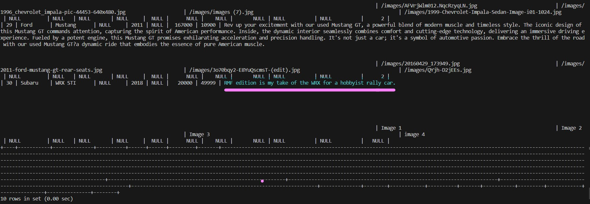

  # Cars-R-Us
  
  
  
  ## Description 
  Introducing Cars-R-Us, the ultimate online destination for all things automotive! Whether you're looking to buy, sell, or simply explore, our web application offers a seamless platform for enthusiasts and sellers alike. Browse through a diverse range of listings for cars and car parts, create your own eye-catching posts with ease, and connect with a community passionate about automobiles.

  ## Table of Content
  [Description](#description) 
  [Installation](#installation) 
  [Usage](#usage) 
  [License](#license) 
  [Contribution](#contribution) 
  [Test](#test) 
  [Questions](#questions) 

  ## Installation
  Review the Heroku Link.
  
  ## Usage
  Feel free to utilize the application through the Heroku link. Creating a profile and posting your car that you would like to sell would be the method of using this application. Further guidelines can be referred to our license usage as well .

  ## License
    This project utilize this MIT.
  
  ## Contribution
  Feel free to reach out if there additional ideas or if there are any issues posted. These are avaliable to be worked on. 
  
  ## Test
  If you clone the repo you can utilize nodemon which is part of the dev dependencies and test out the different routes. We have a few images below that verify the use of some of our features as well.  

  **Example of Initial Login for our Application:**  
  

  **Example of Landing page after Successful Login:**  
  

  **Example of Listing Page after Sucessful Login:**  
  

  

  

  **Example of Creating a Post after Sucessful Login:**  
  

  

  **Example of Post for New User Verification:**  
  

  **Example of Post for New Inventory Post Verification:**  
  
  

  ## Questions
  Thank you again for reviewing this README.md.  
  If you have additional questions please feel free to email me and feel free to check out my other repos.  
  GitHub: 
          [chasqui10](https://github.com/chasqui10)  
          [DaedalusStudios](https://https://github.com/DaedalusStudios)  
          [Wxxlfe](https://github.com/Wxxlfe)  
          [zanderscott](https://github.com/zanderscott)  
  Email:  [chasqui.rmf@gmail.com](chasqui.rmf@gmail.com) 
